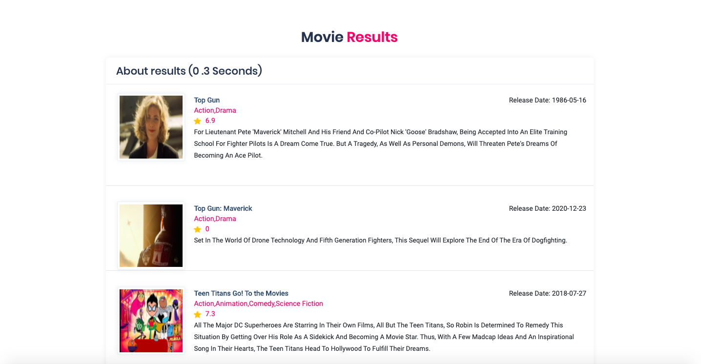

# LuceneSpringboot

(Movie Search Engine Application)

 
 

Step 1.Make sure you have installed mysql database ,create a database named movies

Step 2: open application.properties file and change the spring.datasource.username

Spring.datasource.password based on the username and password you gave on mysql workbench and

also change document.index.dir

Step 3.http://localhost:8080/api/v1/movies/dump

It will dump all the movies into the mysql database and start the indexing process. It will take around 3-4 minutes . it

will give a success message after successfully dumping the movies into mysql database it will start the indexing

process.

Step 4 : http://localhost:8080/api/v1/movies/search?query=tom cruise movies

In the search bar type search queries like

1.tom cruise movies

2. Movies directed by james cameron

3. Action movies by arnold
